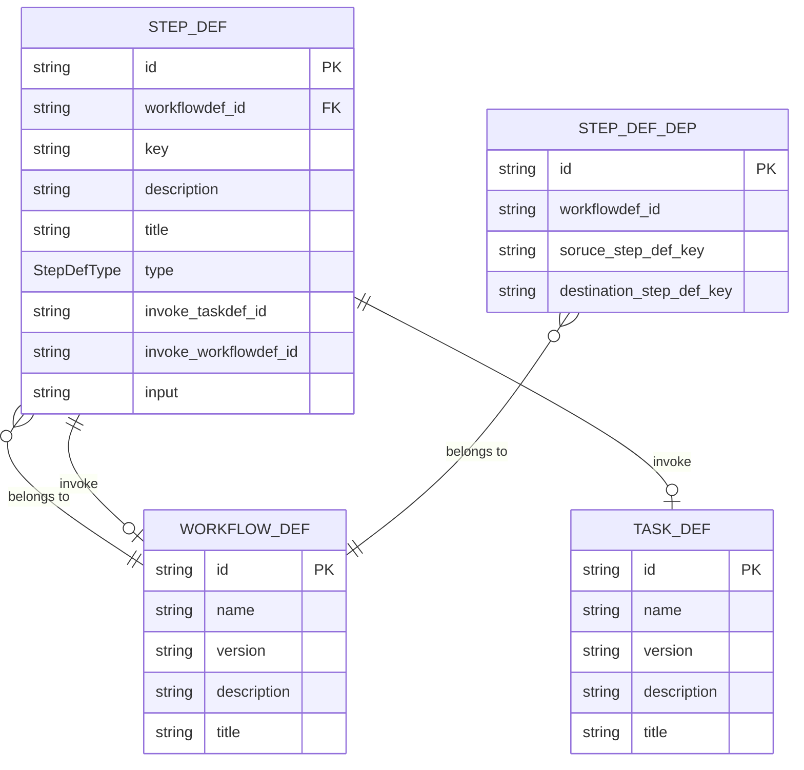
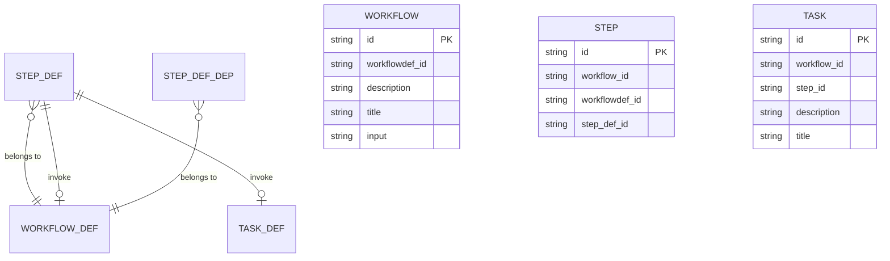

# Index
* [定义层](#定义层)
    * [定义层关系](#定义层关系)
    * [WORKFLOW_DEF](#workflow_def)
    * [TASK_DEF](#task_def)
    * [STEP_DEF](#step_def)
    * [STEP_DEF_DEP](#step_def_dep)

# 定义层
## 定义层关系

## WORKFLOW_DEF
这个模型完全定义一个Workflow
* `name + version`是唯一的。我们通常可以用name来指代这个Workflow定义。
* `title`: 对于这个workflow定义的，人类可以理解的短描述
* `description`: 对于这个workflow定义的，人类可以理解的完整描述

## STEP_DEF
一个workflow由多个步骤定义组成。每个STEP_DEF定义一个步骤。
* 每个步骤的`key`在它所在的WorkflowDef中是唯一的。
* 每个步骤，它的类型，可以是执行一个task，或者执行一个嵌套的workflow。
* `input`是一个表达式，它负责提供这个step的输入参数，这个参数将来会被传递到相应的task或者workflow

## TASK_DEF
它定义了一个task类型。task定义是独立的，全局的，不从属于某个特定的Workflow def。
* `name + version`是唯一的。我们通常可以用name来指代这个task定义。
* `title`: 对于这个workflow定义的，人类可以理解的短描述
* `description`: 对于这个workflow定义的，人类可以理解的完整描述

## STEP_DEF_DEP
它定义了一个在一个workflow def中，不同step之间的依赖关系。

# 执行层

# 一些规则
* 数据库的表的名字中可以有下划线。比如, `workflow_def`
* 数据库的表的字段名字可以有下划线。比如, `workflow_def_id`
* 表的名字用单数而非复数，比如 `workflow`